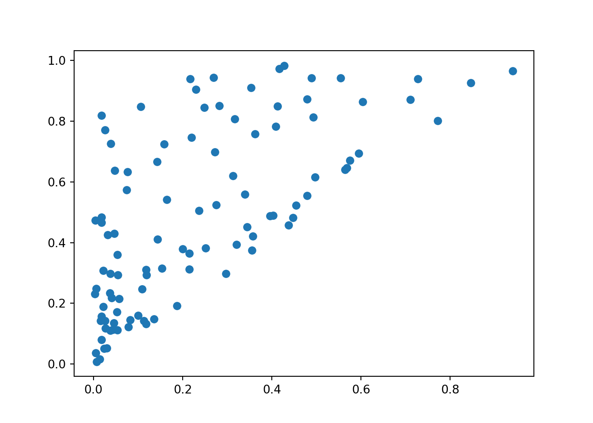
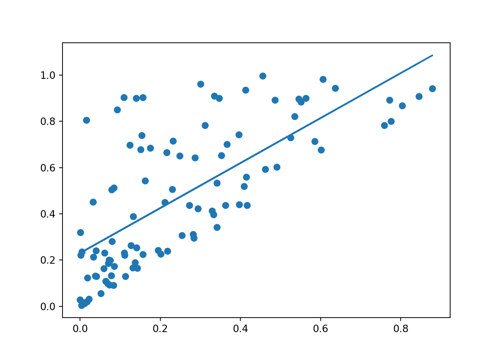

In this article, I will try to do linear regressions with Python. 
This is also an occasion for me to try python with Quarto. 

# Quarto configuration for Python

To work with python code in Quarto, we first have to use an engine that supports python. 
For that, we can use `python3` or `jupyter` for examples. 
Thus, in our `YAML` header, we would enter : 

```{.yaml}
---
engine: python3
# or : 
engine: jupyter
---
```

We can check our engines with quarto with the command `quarto check`. 
This function is designed to "verify [the] correct functioning of Quarto installation" (from its description in documentation).
Running it returns the versions of different kernels that we can use.

Finally, to include python code in our Quarto file, we can write : 

````
```{{python}}
# Some python code here
```
````

For example : 


::: {.cell}

```{.python .cell-code}
# Getting the version of Python we are using : 
import sys 
sys.version_info
```

::: {.cell-output .cell-output-stdout}

```
sys.version_info(major=3, minor=12, micro=4, releaselevel='final', serial=0)
```


:::
:::


Here, we are for example using Python 3.12.

## Running Julia and R in the same document 

Depending on the engine we are using, we can also make use of other languages in the same Quarto document. 
Specifying the `python3` engine in the `YAML` header of our Quarto document, we can run Julia and R in it.
For that, we need packages, such as `JuliaCall` for using Julia with R.

Testing Julia yields : 


::: {.cell}

```{.julia .cell-code}
# Getting the version of Julia we are using : 
using InteractiveUtils
InteractiveUtils.versioninfo()
```

::: {.cell-output .cell-output-stdout}

```
Julia Version 1.10.3
Commit 0b4590a550 (2024-04-30 10:59 UTC)
Build Info:
  Built by Homebrew (v1.10.3)

    Note: This is an unofficial build, please report bugs to the project
    responsible for this build and not to the Julia project unless you can
    reproduce the issue using official builds available at https://julialang.org/downloads

Platform Info:
  OS: macOS (arm64-apple-darwin23.4.0)
  CPU: 8 × Apple M1
  WORD_SIZE: 64
  LIBM: libopenlibm
  LLVM: libLLVM-15.0.7 (ORCJIT, apple-m1)
Threads: 1 default, 0 interactive, 1 GC (on 4 virtual cores)
Environment:
  DYLD_FALLBACK_LIBRARY_PATH = /Library/Frameworks/R.framework/Resources/lib:/Library/Java/JavaVirtualMachines/jdk-11.0.18+10/Contents/Home/lib/server
```


:::
:::


Testing R yields : 


::: {.cell}

```{.r .cell-code}
# Getting the version of R we are using : 
version
```

::: {.cell-output .cell-output-stdout}

```
               _                           
platform       aarch64-apple-darwin20      
arch           aarch64                     
os             darwin20                    
system         aarch64, darwin20           
status                                     
major          4                           
minor          4.0                         
year           2024                        
month          04                          
day            24                          
svn rev        86474                       
language       R                           
version.string R version 4.4.0 (2024-04-24)
nickname       Puppy Cup                   
```


:::
:::


Since the rest of the article will exclusively be using python, we will not mention further details of engines in Quarto.
It is however interesting to keep in mind that Quarto allows this multiple integration.

# Simple linear regression

This section of the article treats how to do a simple linear regression with Python. 
We will first generate random data, we will plot it, and we will then add the linear regression in our plot. 

## Generating data

I found two main libraries to generate random data in Python. 
The first one is the `random` library, and the second one is the `numpy` library.

With the random library, we can use the `random` method to generate by default a float number between 0 and 1. 
A way to create a vector of 100 random values is to use the `random` method between square brackets, followed by the `for` instruction, similar to the one in Julia. 
This will generate a list of size 100, such that : 


::: {.cell}

```{.python .cell-code}
import random
y = ([random.random() for _ in range(100)])
x = ([random.random()*y[_] for _ in range(100)])
```
:::


Let us comment a bit this code : 

- It is possible to call methods with the name of their libraries in front of it.
In this sense, `random.random` refers to the method `random` inside the `random` library.
- The underscore syntax `_` combined with `for` loops to iterated for a set number of times. 
By default, it just ass
- The `range()` function allows to
> Return an object that produces a sequence of integers from start (inclusive) to stop (exclusive) by step.
Range(i, j) produces i, i+1, i+2, ..., j-1. Start defaults to 0, and stop is omitted!  range(4) produces 0, 1, 2, 3.
These are exactly the valid indices for a list of 4 elements.
When step is given, it specifies the increment (or decrement).

A second way of generating random data is using the numpy library. 


::: {.cell}

```{.python .cell-code}
import numpy
print("test")
```

::: {.cell-output .cell-output-stdout}

```
test
```


:::
:::


## Plotting the data

Now that we generated some data, let us plot it.
To do that, we can use the [matplotlib library](https://matplotlib.org/). 
More specifically, we are going to use pyplot inside matplotlib, and are thus going to import `matplotlib.pyplot` :


::: {.cell}

```{.python .cell-code}
import matplotlib.pyplot
matplotlib.pyplot.scatter(x,y)
```

::: {.cell-output-display}
{width=672}
:::
:::


- The `scatter()` function of `matplotlib.pyplot` allows to plot a scatterplot with two vectors of the same size.

>> The `scatter()` "function" could also being called a "method".
This distinction seems to also exist in other programming languages and is definitely worth understanding. 
For the sake of linear regressions, it does not matter for now to develop a full grasp of this distinction.
In the rest of this article, we will thus stick to the "function" term. 
We should however keep in mind that there exists a distinction between the terms.

## Fitting our model

We are now going to fit our statistical model with our randomly generated values. 
In order for us to do that, we can use the `scipy.stats` library.
This library has a `linregress()` function that allows to compute the OLS estimates to explain the second variable with the second one : 


::: {.cell}

```{.python .cell-code}
import scipy
model = scipy.stats.linregress(x,y)
model
```

::: {.cell-output .cell-output-stdout}

```
LinregressResult(slope=np.float64(0.9734407578606362), intercept=np.float64(0.23002345218812098), rvalue=np.float64(0.7080387892633788), pvalue=np.float64(1.7549456037815375e-16), stderr=np.float64(0.0980733206189618), intercept_stderr=np.float64(0.03299926129338259))
```


:::
:::


We see that the `scipy.stats.linregress()` function returns a five elements object.
To make it easier to see, we could generate five variables, define a function with those variables and plot a line based on this function : 


::: {.cell}

```{.python .cell-code}
slope, intercept, r, p, std_err = scipy.stats.linregress(x, y)

def myfunc(x):
  return slope * x + intercept

mymodel = list(map(myfunc, x))
```
:::


Now, if we want to add this line to our plot, we can run : 


::: {.cell}

```{.python .cell-code}
matplotlib.pyplot.scatter(x,y)
matplotlib.pyplot.plot(x, mymodel)
```

::: {.cell-output-display}
{width=672}
:::
:::


If we want only the more relevant information, we can choose to only work with the two first elements of the array, and plot it : 


::: {.cell}

```{.python .cell-code}
def f(x):
    return scipy.stats.linregress(x, y)[1]+numpy.dot(x,scipy.stats.linregress(x, y)[0])

float(scipy.stats.linregress(x, y)[1]),float(scipy.stats.linregress(x, y)[0])
```

::: {.cell-output .cell-output-stdout}

```
(0.23002345218812098, 0.9734407578606362)
```


:::

```{.python .cell-code}
matplotlib.pyplot.scatter(x,y)
matplotlib.pyplot.plot(x, f(x))
```

::: {.cell-output-display}
{width=672}
:::
:::


Now that we covered a how to perform a simple linear regression with Python, let us move to a multiple linear regression.

# Multiple linear regression

In this section, we are going to perform a multiple linear regression. 
First, we are going to generate data and fit our model.
Then, we will plot a static scatter plot, and finally a rotatable plot. 

## Running a multiple linear regression

First, let us generate some random data and fit our model : 


::: {.cell}

```{.python .cell-code}
x,y,z = (numpy.dot([random.random() for _ in range(100)],_) for _ in (1,2,3))
len(y)
```

::: {.cell-output .cell-output-stdout}

```
100
```


:::
:::


## Plotting a static 3D plot

If we now want to limit ourselves to a three dimensional problem, we can plot 3D graphs. 
In this section, we are going to plot a static graph. 


::: {.cell}

```{.python .cell-code}
A = matplotlib.pyplot.figure()
B = A.add_subplot(projection='3d')
B.scatter(x,y,z)
B.set_xlabel("X")
B.set_ylabel("Y")
B.set_zlabel("Z")
```

::: {.cell-output-display}
{width=672}
:::
:::


## Plotting a rotatable 3D plot 

Now it's time for a rotatable plot, like in the previous article. 
Fortunately, the plotly library does also exist for Python, which is great, because I did not find any other library to get a similar result. 
The thing with plotly is that it requires a syntax involving pandas. 
I thus create a dataframe object from a dictionary with the three previously created vectors. 
In the end, I get : 


::: {.cell}

```{.python .cell-code}
import plotly.express as px
import pandas
data = {'c1':[x],'c2':[y],'c3':[z]}
X = pandas.DataFrame(data)
fig = px.scatter_3d(X, x,y,z)
fig.show()
```

::: {.cell-output-display}

```{=html}
<div>                        <script type="text/javascript">window.PlotlyConfig = {MathJaxConfig: 'local'};</script>
        <script charset="utf-8" src="https://cdn.plot.ly/plotly-2.32.0.min.js"></script>                <div id="42327f38-806c-42ff-b56c-759c089abd96" class="plotly-graph-div" style="height:100%; width:100%;"></div>            <script type="text/javascript">                                    window.PLOTLYENV=window.PLOTLYENV || {};                                    if (document.getElementById("42327f38-806c-42ff-b56c-759c089abd96")) {                    Plotly.newPlot(                        "42327f38-806c-42ff-b56c-759c089abd96",                        [{"hovertemplate":"x=%{x}\u003cbr\u003ey=%{y}\u003cbr\u003ez=%{z}\u003cextra\u003e\u003c\u002fextra\u003e","legendgroup":"","marker":{"color":"#636efa","symbol":"circle"},"mode":"markers","name":"","scene":"scene","showlegend":false,"x":[0.07859700171026218,0.8592764360328935,0.3280037675241779,0.03271626088346302,0.049898679977316784,0.6976725535429308,0.6804316165852171,0.8703162280498478,0.7412635735413403,0.05106420402705336,0.3494426756016644,0.8210197222710222,0.8834793700874657,0.17443214078977587,0.6602798983338595,0.03145106029518363,0.024903805994007322,0.02994515062710912,0.5658015560888856,0.6416345432217093,0.27404854582259763,0.22976727295282084,0.5288735131912821,0.11467704901559672,0.8678449146807374,0.4200106881890787,0.4726848244018328,0.6417651836466969,0.786314315916339,0.021163264745701516,0.23388740069031633,0.5940989930098877,0.21296918545413412,0.9075448344624187,0.16059939213956487,0.5885470531969706,0.9181444691453643,0.16363737297599912,0.06539978204506036,0.029146018151621433,0.05074711878320426,0.23053064662392175,0.13689862011607168,0.8301006656858717,0.21433311827282453,0.5690222225927772,0.8211021003379849,0.8992284629862678,0.2112644050837036,0.6702822533406564,0.48889224747412596,0.9141367955755173,0.939069858109776,0.18435643223621734,0.896332924787546,0.7978506470334205,0.24661264205418498,0.6112162909158287,0.3125566118230375,0.4907153696543144,0.20705375263155978,0.172187682713679,0.45866912095465484,0.8366173356763242,0.6551484439348019,0.19651536560683902,0.6957931520390191,0.33781372185071057,0.3735460395349407,0.4865663757749368,0.8565023962191862,0.6739407495184073,0.0726806523971315,0.2969323078684807,0.8293034160402398,0.9883100103186421,0.16918547446251653,0.053671610697476835,0.5817595243814744,0.8207433621944016,0.2169431297190476,0.9850494935273235,0.33826794181592357,0.993091482302869,0.7389411590535919,0.5543403256892914,0.4365766539828212,0.39821458547424926,0.6817476749356166,0.1723814554947547,0.7353347336924749,0.061039459633951854,0.5309362129990395,0.13284230430361532,0.8119554777144342,0.43244595797601226,0.4664970862202651,0.6045530541303162,0.9516469120825618,0.9411072233009534],"y":[0.5620727252699564,1.343375518804141,1.6476638049058137,1.4051116753350334,0.010399052780563522,0.44775102030764224,0.7227966197814317,1.2036326212027697,1.6509660329340121,0.5395677234767173,0.9223449068003136,0.9200616910455797,1.3707168447537506,0.051967802900443116,1.967943321676217,0.3428945661487963,1.7675415378266695,0.4159574855036654,1.911142370442452,1.3732296092617085,0.928309368975631,0.8828629781093997,0.5548946281393474,1.754007680280433,0.5506525371092623,0.6562578982597722,1.3083158833509616,0.917728386568391,0.8246837033394139,0.7152599484098614,0.20277692843175021,1.6052892620894377,1.9081665481381078,0.9113132503519121,1.550370184521307,0.8593224581349661,1.518366832620292,1.9221955386015017,0.6723060619197501,1.7626866034504824,1.8780790265261138,0.08683450316599828,1.2408707180499414,1.4550338205242566,1.7152127420751555,1.2679649047532702,0.39649417679269217,0.6122622928522832,0.15659920067019417,1.3099377910176466,1.7440521704729148,1.456271062202281,1.3515711048882437,0.1657066442587729,0.232691633548743,1.6047886447644186,1.7976497527702218,0.757719305733912,0.32990075583602474,1.4761160480468563,1.8156259902420313,0.20523547293720923,1.6601002693632885,0.8765069629439803,0.5948664261336902,1.6336084265293256,0.8203257352931903,1.8438969710226947,0.012893697053111053,0.6005790187123752,0.3552567760320027,0.28918483404801054,1.9193926429234474,0.8318927588405913,1.6571224295510434,1.9292610537774126,0.03489377389112547,1.3148385583087447,1.7346009004068987,1.0379810715665818,0.5995077384035448,0.6424408647564235,1.9972692048387457,0.7724158352274155,0.21296965274254998,0.3277335540213333,1.3493376754130224,1.0187326503328529,0.16568134623207653,0.1951276624498035,1.7238522438685435,0.5254955481036303,1.8267697360907518,1.7763902616045961,0.8620585853235865,1.9529169857221707,0.1349158799755641,1.0451623349131745,1.588124324722652,1.6392619310868635],"z":[0.4622574492963535,2.6632491786699104,2.561371165737911,0.08506076488589798,2.699675264904033,0.027385870771598375,2.854126740701682,2.319786419280412,1.627053063516847,1.854360294041241,1.0768216483603383,2.649427053013655,0.08380661277277013,0.4556596356243928,0.7143383500600948,2.997642064878142,2.7698606736329308,2.6407949490354747,1.5976902585749921,0.1105994611318234,2.6842076244606523,2.6268249807058908,0.24880830667970466,2.515231757043771,2.1106784024286585,1.1050941170376036,0.6595196258156076,2.9279608976848106,0.400248199043423,0.5399763051375317,2.68469605594561,0.23721696510193147,0.9502608914265009,1.1624803138305793,0.6912617483544204,2.097634797109782,2.951011349785118,2.7968755565764356,0.17096811042456483,2.531112998448071,0.0366931799416742,1.9482295379011534,0.6945086748489593,0.7015255943414026,2.427926057346451,2.1672668284975036,0.7863942260768098,0.8600908730715129,0.19813104752500943,0.610436046818241,0.6793383679696522,0.6415752400388456,0.060500768152760065,1.0086942563262409,0.9208240391785859,1.6483677290668273,0.13776233637201207,0.7610932208854231,0.605937616889334,0.3511448177486396,2.474726308469596,1.4014754590029244,0.8413371264613052,0.9099157954379247,0.806061321484171,1.6725418664984733,1.1961117094577127,0.14268029507257918,0.10754367399127795,0.021923858876559676,0.5432588898028247,2.291069523654328,0.19489537697763193,2.2445574191018167,0.5681028835952949,2.4254250804227837,0.8426538010454155,1.89953825153161,1.6488215113396898,2.8953952518192305,0.8709056958427518,0.672785688133816,0.5276172310799218,2.749416111479842,1.9029439029805464,0.18445760988492954,2.690265440910421,2.906859291309796,2.6592722334459946,2.33442315764804,0.3562297332295332,2.262394486673008,0.6627599102489834,2.7502589321607864,1.2554110106772622,2.1668753528441154,2.188006225932961,1.3074071052971448,2.041143593573354,1.2954676256482045],"type":"scatter3d"}],                        {"template":{"data":{"histogram2dcontour":[{"type":"histogram2dcontour","colorbar":{"outlinewidth":0,"ticks":""},"colorscale":[[0.0,"#0d0887"],[0.1111111111111111,"#46039f"],[0.2222222222222222,"#7201a8"],[0.3333333333333333,"#9c179e"],[0.4444444444444444,"#bd3786"],[0.5555555555555556,"#d8576b"],[0.6666666666666666,"#ed7953"],[0.7777777777777778,"#fb9f3a"],[0.8888888888888888,"#fdca26"],[1.0,"#f0f921"]]}],"choropleth":[{"type":"choropleth","colorbar":{"outlinewidth":0,"ticks":""}}],"histogram2d":[{"type":"histogram2d","colorbar":{"outlinewidth":0,"ticks":""},"colorscale":[[0.0,"#0d0887"],[0.1111111111111111,"#46039f"],[0.2222222222222222,"#7201a8"],[0.3333333333333333,"#9c179e"],[0.4444444444444444,"#bd3786"],[0.5555555555555556,"#d8576b"],[0.6666666666666666,"#ed7953"],[0.7777777777777778,"#fb9f3a"],[0.8888888888888888,"#fdca26"],[1.0,"#f0f921"]]}],"heatmap":[{"type":"heatmap","colorbar":{"outlinewidth":0,"ticks":""},"colorscale":[[0.0,"#0d0887"],[0.1111111111111111,"#46039f"],[0.2222222222222222,"#7201a8"],[0.3333333333333333,"#9c179e"],[0.4444444444444444,"#bd3786"],[0.5555555555555556,"#d8576b"],[0.6666666666666666,"#ed7953"],[0.7777777777777778,"#fb9f3a"],[0.8888888888888888,"#fdca26"],[1.0,"#f0f921"]]}],"heatmapgl":[{"type":"heatmapgl","colorbar":{"outlinewidth":0,"ticks":""},"colorscale":[[0.0,"#0d0887"],[0.1111111111111111,"#46039f"],[0.2222222222222222,"#7201a8"],[0.3333333333333333,"#9c179e"],[0.4444444444444444,"#bd3786"],[0.5555555555555556,"#d8576b"],[0.6666666666666666,"#ed7953"],[0.7777777777777778,"#fb9f3a"],[0.8888888888888888,"#fdca26"],[1.0,"#f0f921"]]}],"contourcarpet":[{"type":"contourcarpet","colorbar":{"outlinewidth":0,"ticks":""}}],"contour":[{"type":"contour","colorbar":{"outlinewidth":0,"ticks":""},"colorscale":[[0.0,"#0d0887"],[0.1111111111111111,"#46039f"],[0.2222222222222222,"#7201a8"],[0.3333333333333333,"#9c179e"],[0.4444444444444444,"#bd3786"],[0.5555555555555556,"#d8576b"],[0.6666666666666666,"#ed7953"],[0.7777777777777778,"#fb9f3a"],[0.8888888888888888,"#fdca26"],[1.0,"#f0f921"]]}],"surface":[{"type":"surface","colorbar":{"outlinewidth":0,"ticks":""},"colorscale":[[0.0,"#0d0887"],[0.1111111111111111,"#46039f"],[0.2222222222222222,"#7201a8"],[0.3333333333333333,"#9c179e"],[0.4444444444444444,"#bd3786"],[0.5555555555555556,"#d8576b"],[0.6666666666666666,"#ed7953"],[0.7777777777777778,"#fb9f3a"],[0.8888888888888888,"#fdca26"],[1.0,"#f0f921"]]}],"mesh3d":[{"type":"mesh3d","colorbar":{"outlinewidth":0,"ticks":""}}],"scatter":[{"fillpattern":{"fillmode":"overlay","size":10,"solidity":0.2},"type":"scatter"}],"parcoords":[{"type":"parcoords","line":{"colorbar":{"outlinewidth":0,"ticks":""}}}],"scatterpolargl":[{"type":"scatterpolargl","marker":{"colorbar":{"outlinewidth":0,"ticks":""}}}],"bar":[{"error_x":{"color":"#2a3f5f"},"error_y":{"color":"#2a3f5f"},"marker":{"line":{"color":"#E5ECF6","width":0.5},"pattern":{"fillmode":"overlay","size":10,"solidity":0.2}},"type":"bar"}],"scattergeo":[{"type":"scattergeo","marker":{"colorbar":{"outlinewidth":0,"ticks":""}}}],"scatterpolar":[{"type":"scatterpolar","marker":{"colorbar":{"outlinewidth":0,"ticks":""}}}],"histogram":[{"marker":{"pattern":{"fillmode":"overlay","size":10,"solidity":0.2}},"type":"histogram"}],"scattergl":[{"type":"scattergl","marker":{"colorbar":{"outlinewidth":0,"ticks":""}}}],"scatter3d":[{"type":"scatter3d","line":{"colorbar":{"outlinewidth":0,"ticks":""}},"marker":{"colorbar":{"outlinewidth":0,"ticks":""}}}],"scattermapbox":[{"type":"scattermapbox","marker":{"colorbar":{"outlinewidth":0,"ticks":""}}}],"scatterternary":[{"type":"scatterternary","marker":{"colorbar":{"outlinewidth":0,"ticks":""}}}],"scattercarpet":[{"type":"scattercarpet","marker":{"colorbar":{"outlinewidth":0,"ticks":""}}}],"carpet":[{"aaxis":{"endlinecolor":"#2a3f5f","gridcolor":"white","linecolor":"white","minorgridcolor":"white","startlinecolor":"#2a3f5f"},"baxis":{"endlinecolor":"#2a3f5f","gridcolor":"white","linecolor":"white","minorgridcolor":"white","startlinecolor":"#2a3f5f"},"type":"carpet"}],"table":[{"cells":{"fill":{"color":"#EBF0F8"},"line":{"color":"white"}},"header":{"fill":{"color":"#C8D4E3"},"line":{"color":"white"}},"type":"table"}],"barpolar":[{"marker":{"line":{"color":"#E5ECF6","width":0.5},"pattern":{"fillmode":"overlay","size":10,"solidity":0.2}},"type":"barpolar"}],"pie":[{"automargin":true,"type":"pie"}]},"layout":{"autotypenumbers":"strict","colorway":["#636efa","#EF553B","#00cc96","#ab63fa","#FFA15A","#19d3f3","#FF6692","#B6E880","#FF97FF","#FECB52"],"font":{"color":"#2a3f5f"},"hovermode":"closest","hoverlabel":{"align":"left"},"paper_bgcolor":"white","plot_bgcolor":"#E5ECF6","polar":{"bgcolor":"#E5ECF6","angularaxis":{"gridcolor":"white","linecolor":"white","ticks":""},"radialaxis":{"gridcolor":"white","linecolor":"white","ticks":""}},"ternary":{"bgcolor":"#E5ECF6","aaxis":{"gridcolor":"white","linecolor":"white","ticks":""},"baxis":{"gridcolor":"white","linecolor":"white","ticks":""},"caxis":{"gridcolor":"white","linecolor":"white","ticks":""}},"coloraxis":{"colorbar":{"outlinewidth":0,"ticks":""}},"colorscale":{"sequential":[[0.0,"#0d0887"],[0.1111111111111111,"#46039f"],[0.2222222222222222,"#7201a8"],[0.3333333333333333,"#9c179e"],[0.4444444444444444,"#bd3786"],[0.5555555555555556,"#d8576b"],[0.6666666666666666,"#ed7953"],[0.7777777777777778,"#fb9f3a"],[0.8888888888888888,"#fdca26"],[1.0,"#f0f921"]],"sequentialminus":[[0.0,"#0d0887"],[0.1111111111111111,"#46039f"],[0.2222222222222222,"#7201a8"],[0.3333333333333333,"#9c179e"],[0.4444444444444444,"#bd3786"],[0.5555555555555556,"#d8576b"],[0.6666666666666666,"#ed7953"],[0.7777777777777778,"#fb9f3a"],[0.8888888888888888,"#fdca26"],[1.0,"#f0f921"]],"diverging":[[0,"#8e0152"],[0.1,"#c51b7d"],[0.2,"#de77ae"],[0.3,"#f1b6da"],[0.4,"#fde0ef"],[0.5,"#f7f7f7"],[0.6,"#e6f5d0"],[0.7,"#b8e186"],[0.8,"#7fbc41"],[0.9,"#4d9221"],[1,"#276419"]]},"xaxis":{"gridcolor":"white","linecolor":"white","ticks":"","title":{"standoff":15},"zerolinecolor":"white","automargin":true,"zerolinewidth":2},"yaxis":{"gridcolor":"white","linecolor":"white","ticks":"","title":{"standoff":15},"zerolinecolor":"white","automargin":true,"zerolinewidth":2},"scene":{"xaxis":{"backgroundcolor":"#E5ECF6","gridcolor":"white","linecolor":"white","showbackground":true,"ticks":"","zerolinecolor":"white","gridwidth":2},"yaxis":{"backgroundcolor":"#E5ECF6","gridcolor":"white","linecolor":"white","showbackground":true,"ticks":"","zerolinecolor":"white","gridwidth":2},"zaxis":{"backgroundcolor":"#E5ECF6","gridcolor":"white","linecolor":"white","showbackground":true,"ticks":"","zerolinecolor":"white","gridwidth":2}},"shapedefaults":{"line":{"color":"#2a3f5f"}},"annotationdefaults":{"arrowcolor":"#2a3f5f","arrowhead":0,"arrowwidth":1},"geo":{"bgcolor":"white","landcolor":"#E5ECF6","subunitcolor":"white","showland":true,"showlakes":true,"lakecolor":"white"},"title":{"x":0.05},"mapbox":{"style":"light"}}},"scene":{"domain":{"x":[0.0,1.0],"y":[0.0,1.0]},"xaxis":{"title":{"text":"x"}},"yaxis":{"title":{"text":"y"}},"zaxis":{"title":{"text":"z"}}},"legend":{"tracegroupgap":0},"margin":{"t":60}},                        {"responsive": true}                    )                };                            </script>        </div>
```

:::
:::


We note that this yields a plot with identical features to the ones obtained in the previous article with Julia. 

If we now want to show the plane that satisfies the OLS condition, we can run : 


::: {.cell}

```{.python .cell-code}
print("test")
```

::: {.cell-output .cell-output-stdout}

```
test
```


:::
:::
